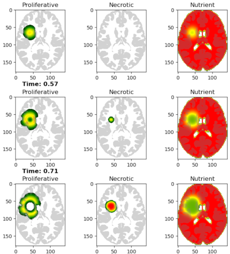

# TumorGrowthToolkit

Welcome to TumorGrowthToolkit, a Python package dedicated to the simulation and analysis of tumor growth using numerical solvers for Partial Differential Equations.


## Models
- Reaction-diffusion multi-cell with a nutrient field (1: proliferative/diffusive, 2: necrotic)  (FK_2c)
- Reaction-diffusion single cell (FK)
  
## Installation

To use the solver, first install the package by cloning this repository and using:
```
pip install -e .
```

## Running solvers/plotting

Example usage in ```FK_2c_example.ipynb.```

## Synthetic patients generator

Example usage:
```
cd synthetic_gens
python run_gen_FK_2c.py
```
Creates synthetic patients with PET images and tumor segmentations (enhancing core, necrotic core, edema).

## References
In publications using TumorGrowthToolkit pleace cite:
1. Balcerak, M., Ezhov, I., Karnakov, P., Litvinov, S., Koumoutsakos, P., Weidner, J., Zhang, R. Z., Lowengrub, J. S., Wiestler, B., & Menze, B. (2023). Individualizing Glioma Radiotherapy Planning by Optimization of a Data and Physics Informed Discrete Loss. arXiv preprint arXiv:2312.05063.
